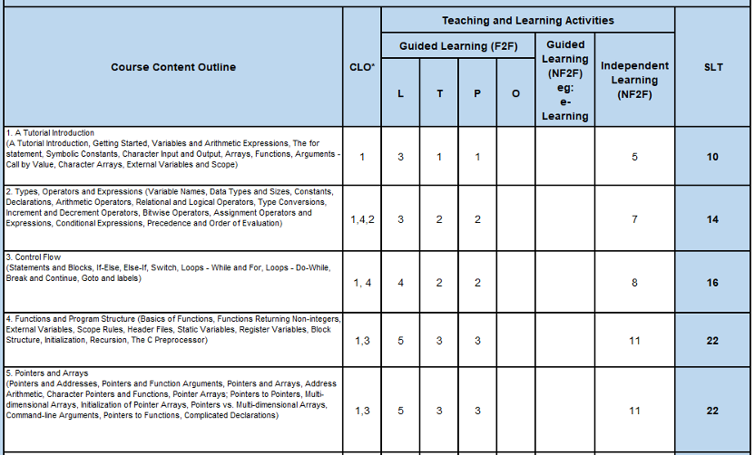
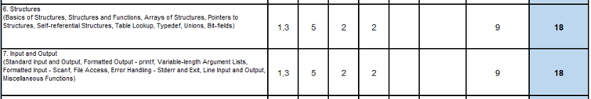
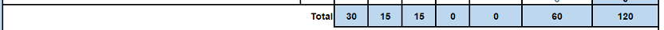

# CST103-Lab-Knowledge-Point-Learning-Tracking-System
Course Code: CST103\
Course Name: Programming in language C\
Academic Session: 2023/09\
Assessment Title: Lab Report and Presentation\
Date: 02/01/2024
## [Description of Coursework](https://github.com/letianjiang2/CST103-Lab-Knowledge-Point-Learning-Tracking-System/blob/main/DESCRIPTION%20OF%20COURSEWORK.pdf)

## [Lab Report](https://github.com/letianjiang2/CST103-Lab-Knowledge-Point-Learning-Tracking-System/tree/main/Lab%20Report)
## Task(s)
This task is to design and develop a software tool, called as "knowledge point learning tracking system "(KPLTS for short), which can help student learn C programming (and other courses in the future) more efficiently and individually.
1. According to the course content outline of CST103, as an example of any specific course, the course content outline is divided into chapters, each of which corresponds to a set of CLOs, learning times under different learning methods and total student learning time spent for this chapter. Each chapter is then divided into several sections, and each section is divided into several knowledge units, or knowledge points in pedagogy jargon. Each section or each knowledge unit should have corresponding set of CLOs, learning times under different learning methods and total student learning time spent for this section or knowledge unit (this information is not illustrated in the official course description file). Course, chapter, section and knowledge unit, these four levels of object have certain coherent relationships. Student should design proper data forms to represent these objects in C programming language (for simplicity, student can ignore the CLO column if he/she feels puzzled). (CLO1)

2. Student starts to review the course according to this course content outline and write down all the covered knowledge units, each in a separated text file. Each section should contain at least one knowledge unit. Student can search for the required knowledge units from textbook or Internet and compile a human-readable, friendly looking text file for each knowledge unit. Student may refer to the contents.txt file for the more detailed course outline, in which the minimum number of knowledge units is indicated by the number in the parentheses following each section. (Extra outcome)
3. Student is requested to design and develop a software to help learn this course. The basic requirements are as the following: (1) This software should have a robust menu system to support friendly interactions between the user and the program. (2) User can browse all the compiled knowledge units. (3) User can select certain knowledge unit to start learning. The program will automatically count time and calculate the elapsed learning time after the user ends learning. (4) There should be a human-readable log text file to record all the learning activities, including at least the starting time, ending time, elapsed time, knowledge unit name, student ID and etc. (5) The software should provide a way to show different kinds of cumulative learning times spent by specific student for specific course on specific chapter, section and knowledge unit. (6) There should be a binary file to store all these different kinds of cumulative learning times, which is updated after each learning activity. (CLO1, CLO2, CLO3, CLO4)
4. Student will write a report about this software. The report should cover the initial goals, primary design ideas, user view functionalities and usage, programmer view software structures and modules, any valuable findings got during this programming process, test cases, conclusion and future work. (CLO4)
5. Student will give a presentation, with some slides and demonstration of this software. The maximum presentation length is 10 minutes for each student. (CLO3)